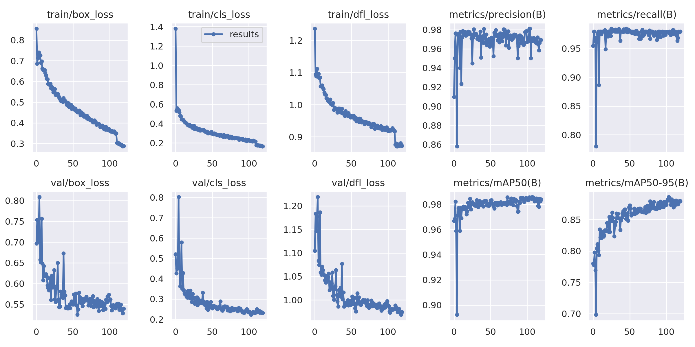
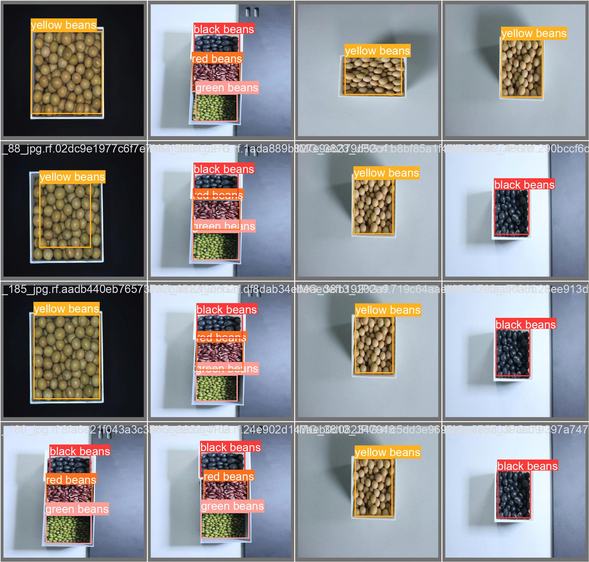

# Multi-Beans Detection Slim

using [Yolov8](https://www.ultralytics.com/yolo) to train (boxes drawed on [Roboflow](https://roboflow.com/))

>Datasets: [Available on Roboflow Universe](https://universe.roboflow.com/teriyaki-d5dx8/multiple-beans)

Now we have trained 4 beans: green, black , yellow and red by using 1700 photos

**Results:**

**Detection Results:**

